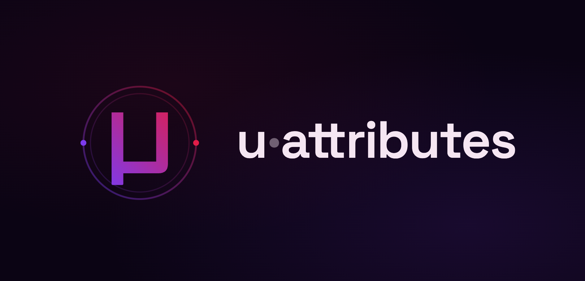

<p align="center">
  <h1 align="center" id="-attributes"></h1>
  <p align="center"><i>Create "immutable" objects with no setters, just getters.</i></p>
  <p align="center">
    <a href="https://badge.fury.io/rb/u-attributes"></a>
    <a href="https://github.com/serradura/u-attributes/actions/workflows/ci.yml"></a>
    <br/>
    <a href="https://qlty.sh/gh/serradura/projects/u-attributes"></a>
    <a href="https://qlty.sh/gh/serradura/projects/u-attributes"></a>
    <br/>
    
    
  </p>
</p>

> [!IMPORTANT]
> **No breaking API changes — ever.** `u-attributes` is a runtime dependency of [`u-case`](https://github.com/serradura/u-case), whose own public API is frozen — so the same compromise applies here. The gem's role is to remain a stable, backward-compatible foundation for every project (directly or transitively) that depends on it.
>
> Major version bumps signal only that a Ruby or `activemodel` version was dropped from the supported matrix — per SemVer, a dependency-floor change. Your code keeps working.

`u-attributes` lets you define classes whose instances expose attribute readers but no setters. Mutation goes through [`#with_attribute`](#with_attribute) / [`#with_attributes`](#with_attributes), which return a new instance — you transform the object instead of modifying it.

## Why u-attributes? <!-- omit in toc -->

- **Lighter than `ActiveModel::Attributes`** — no Rails dependency required; ActiveModel integration is opt-in.
- **More than `Struct`** — defaults (including callable ones), required keys, value validation (`accept:` / `reject:`), per-attribute visibility, freezing, immutable updates, and deep composition.
- **Opt-in surface** — start with `include Micro::Attributes`; layer `:diff`, `:accept`, `:initialize`, `:keys_as_symbol`, and ActiveModel validations only when needed.
- **Composes recursively** — nested children via `accept:` or inline blocks; hashes auto-coerce, and validation errors bubble up the tree (see [Composition](#composition)).

## Quick start <!-- omit in toc -->

```ruby
require 'u-attributes'

class Person
  include Micro::Attributes.with(:initialize)

  attribute :name, default: 'Anonymous'
  attribute :age,  required: true
end

person = Person.new(age: 21)
person.name # "Anonymous"
person.age  # 21

older = person.with_attribute(:age, 22)
older.age            # 22
older.equal?(person) # false  — a new instance

# There are no setters.
person.name = 'X'    # NoMethodError
```

Prefer a one-liner? [`Micro::Attributes.new`](#microattributesnew) returns a fresh class with `:initialize` and `:accept` enabled by preset:

```ruby
Person = Micro::Attributes.new do
  attribute :name, default: 'Anonymous'
  attribute :age,  required: true
end
```

Need nested attributes? Define them inline with a [block](#defining-nested-attributes-inline-block-form) — child blocks inherit the host's feature mix and [compose to any depth](#deep-nesting--validation-bubbling):

```ruby
Order = Micro::Attributes.new do
  attribute :id, accept: Integer

  attribute :customer do
    attribute :name,  accept: String
    attribute :email, accept: String
  end
end

order = Order.new(id: 1, customer: { name: 'Rodrigo', email: 'rodrigo@example.com' })
order.customer.name # "Rodrigo"
```

See [Feature overview](#feature-overview) for what else the gem can do.

## Documentation <!-- omit in toc -->

| Version    | Documentation                                                 |
| ---------- | ------------------------------------------------------------- |
| unreleased | https://github.com/serradura/u-attributes/blob/main/README.md |
| 3.1.0      | https://github.com/serradura/u-attributes/blob/v3.x/README.md |
| 2.8.0      | https://github.com/serradura/u-attributes/blob/v2.x/README.md |

## A note on syntax <!-- omit in toc -->

Examples in this README use two modern Ruby features. The gem itself supports Ruby `>= 2.7`, so if you're on an older runtime, here's how to read them back to the classic form.

**[`it` block parameter](https://docs.ruby-lang.org/en/3.4/syntax/methods_rdoc.html#label-Numbered+parameters)** — Ruby 3.4+

```ruby
# Modern (Ruby >= 3.4) — what you'll see throughout this README
attribute :age,  default: -> { it&.to_i }
attribute :name, accept:  -> { it.is_a?(String) && !it.empty? }

# Classic — equivalent on every supported Ruby
attribute :age,  default: ->(value) { value&.to_i }
attribute :name, accept:  ->(value) { value.is_a?(String) && !value.empty? }
```

**[Hash value omission](https://docs.ruby-lang.org/en/3.1/syntax/literals_rdoc.html#label-Hash+Literals)** — Ruby 3.1+

When a hash key matches an in-scope local variable (or method) name, you can drop the value:

```ruby
name = 'Ada'
age  = 21

# Modern (Ruby >= 3.1)
Person.new(name:, age:)

# Classic — equivalent on every supported Ruby
Person.new(name: name, age: age)
```

# Table of contents <!-- omit in toc -->

- [Installation](#installation)
- [Compatibility](#compatibility)
- [Feature overview](#feature-overview)
  - [What you get by default](#what-you-get-by-default)
  - [Opt-in extensions](#opt-in-extensions)
  - [Picking a combination](#picking-a-combination)
- [Defining attributes](#defining-attributes)
  - [`attribute` and `attributes`](#attribute-and-attributes)
  - [Defaults](#defaults)
  - [Required attributes](#required-attributes)
  - [Visibility (`private:`, `protected:`)](#visibility-private-protected)
  - [Freezing values (`freeze:`)](#freezing-values-freeze)
  - [Inheritance and `.attribute!`](#inheritance-and-attribute)
- [The initialize extension](#the-initialize-extension)
  - [Standard mode](#standard-mode)
  - [Strict mode](#strict-mode)
  - [`#with_attribute()`](#with_attribute)
  - [`#with_attributes()`](#with_attributes)
  - [Extracting attributes from another object or hash](#extracting-attributes-from-another-object-or-hash)
  - [Writing your own constructor](#writing-your-own-constructor)
- [Reading attributes](#reading-attributes)
  - [Class-level: `.attributes`, `.attribute?`](#class-level-attributes-attribute)
  - [Instance-level: `#attribute`, `#attribute!`, `#attribute?`](#instance-level-attribute-attribute-attribute)
  - [The `#attributes` hash](#the-attributes-hash)
    - [`keys_as:` — control key type](#keys_as--control-key-type)
    - [Slicing with `*names` or `[names]`](#slicing-with-names-or-names)
    - [`with:` and `without:`](#with-and-without)
  - [`#defined_attributes`](#defined_attributes)
- [Other extensions](#other-extensions)
  - [Accept extension](#accept-extension)
    - [What can `accept:` / `reject:` receive?](#what-can-accept--reject-receive)
    - [`allow_nil:` option](#allow_nil-option)
    - [`rejection_message:` option](#rejection_message-option)
    - [Strict mode (`accept: :strict`)](#strict-mode-accept-strict)
    - [Interaction with other features](#interaction-with-other-features)
  - [ActiveModel validations extension](#activemodel-validations-extension)
  - [Diff extension](#diff-extension)
  - [Keys as Symbol extension](#keys-as-symbol-extension)
- [Composition](#composition)
  - [`Micro::Attributes.new`](#microattributesnew)
    - [Enabling extensions](#enabling-extensions)
  - [Nested attributes via `accept:`](#nested-attributes-via-accept)
  - [Defining nested attributes inline (block form)](#defining-nested-attributes-inline-block-form)
    - [Per-block extensions](#per-block-extensions)
  - [Deep nesting \& validation bubbling](#deep-nesting--validation-bubbling)
    - [Accept-error bubbling (no ActiveModel needed)](#accept-error-bubbling-no-activemodel-needed)
    - [ActiveModel deep validation](#activemodel-deep-validation)
- [Notes](#notes)
  - [What "immutable" means here (and thread safety)](#what-immutable-means-here-and-thread-safety)
  - [Unknown keys in `extract_attributes_from`](#unknown-keys-in-extract_attributes_from)
  - [Migrating from 2.x](#migrating-from-2x)
- [Development](#development)
- [Contributing](#contributing)
- [License](#license)
- [Code of Conduct](#code-of-conduct)

# Installation

Add this line to your application's Gemfile and `bundle install`:

```ruby
gem 'u-attributes', '~> 3.0'
```

# Compatibility

| u-attributes | branch | ruby     | activemodel    |
| ------------ | ------ | -------- | -------------- |
| unreleased   | main   | >= 2.7   | >= 6.0         |
| 3.1.0        | v3.x   | >= 2.7   | >= 6.0         |
| 2.8.0        | v2.x   | >= 2.2.0 | >= 3.2, <= 8.1 |

This library is tested (CI matrix) against:

| Ruby / Rails | 6.0 | 6.1 | 7.0 | 7.1 | 7.2 | 8.0 | 8.1 | Edge |
| ------------ | --- | --- | --- | --- | --- | --- | --- | ---- |
| 2.7          | ✅  | ✅  | ✅  | ✅  |     |     |     |      |
| 3.0          | ✅  | ✅  | ✅  | ✅  |     |     |     |      |
| 3.1          |     |     | ✅  | ✅  | ✅  |     |     |      |
| 3.2          |     |     | ✅  | ✅  | ✅  | ✅  |     |      |
| 3.3          |     |     | ✅  | ✅  | ✅  | ✅  | ✅  | ✅   |
| 3.4          |     |     |     |     | ✅  | ✅  | ✅  | ✅   |
| 4.x          |     |     |     |     |     |     | ✅  | ✅   |
| Head         |     |     |     |     |     |     | ✅  | ✅   |

> **Note:** `activemodel` is an optional dependency; the [ActiveModel validations extension](#activemodel-validations-extension) needs it.

# Feature overview

`u-attributes` is a small core (`include Micro::Attributes`) plus opt-in extensions. The two tables below map every feature in the gem so you can scan what's possible before diving into details.

## What you get by default

Everything in this table is available the moment you `include Micro::Attributes` — no `.with(...)` required.

| Capability                | Example                                            | Notes                                                                                                     |
| ------------------------- | -------------------------------------------------- | --------------------------------------------------------------------------------------------------------- |
| Define an attribute       | `attribute :name`                                  | Public reader; no setter                                                                                  |
| Define many at once       | `attributes :a, :b, default: 0`                    | Trailing options apply to every name                                                                      |
| Override in a subclass    | `attribute! :name, default: 'X'`                   | Subclass-only                                                                                             |
| Default value             | `attribute :name, default: 'X'`                    | Static value or `proc { it... }` / `-> { it... }`                                                         |
| Required (without strict) | `attribute :name, required: true`                  | Raises on missing key if `attributes=` is invoked with one                                                |
| Freeze the value          | `attribute :name, freeze: true`                    | Also `:after_dup`, `:after_clone`                                                                         |
| Visibility                | `attribute :secret, private: true`                 | Or `protected: true`; hidden from `#attributes` hash                                                      |
| Layer extensions inline   | `with :keys_as_symbol`                             | Class macro — see [Opt-in extensions](#opt-in-extensions)                                                 |
| Block-form nested         | `attribute :foo do ... end`                        | Anonymous inline class; inherits the host's feature mix                                                   |
| Hash → child coercion     | `attribute :child, accept: Other`                  | When `Other` includes `Micro::Attributes`, a hash auto-builds an instance                                 |
| Deep-error bubble marker  | `parent.attributes_errors['child']`                | Descendant errors mirror up as `'is invalid'` (requires `:accept` on the parent so the error hash exists) |
| Struct-style factory      | `User = Micro::Attributes.new { attribute :name }` | Returns a class; preset is `initialize: true, accept: true`                                               |

## Opt-in extensions

Mix any combination via `Micro::Attributes.with(...)` — hash-style and positional-symbol APIs both work and can be combined.

| Extension                   | Hash API                     | Positional API             | What it adds                                                                                                                                                                                                                                   |
| --------------------------- | ---------------------------- | -------------------------- | ---------------------------------------------------------------------------------------------------------------------------------------------------------------------------------------------------------------------------------------------- |
| **Initialize**              | `initialize: true`           | `:initialize`              | Auto-generated `new(hash)` constructor + immutable `#with_attribute(s)`                                                                                                                                                                        |
| **Initialize (strict)**     | `initialize: :strict`        | (hash only)                | All attributes without a default become **required**; missing keys raise `ArgumentError`. Implies `Initialize`.                                                                                                                                |
| **Accept**                  | `accept: true`               | `:accept`                  | `accept:` / `reject:` / `allow_nil:` / `rejection_message:` validation; `#attributes_errors`, `#attributes_errors?`, `#accepted_attributes`, `#rejected_attributes`                                                                            |
| **Accept (strict)**         | `accept: :strict`            | (hash only)                | Any rejection raises `ArgumentError` immediately. Implies `Accept`.                                                                                                                                                                            |
| **Diff**                    | `diff: true`                 | `:diff`                    | `#diff_attributes(other)` returns a `Diff::Changes` (`#changed?`, `#differences`, etc.)                                                                                                                                                        |
| **Keys as Symbol**          | `keys_as: :symbol`           | `:keys_as_symbol`          | Symbol-keyed storage; disables indifferent access for performance/strictness                                                                                                                                                                   |
| **ActiveModel Validations** | `active_model: :validations` | `:activemodel_validations` | Mixes `ActiveModel::Validations` (`valid?`, `errors`, `validates :x, presence: true`, the `validates:` / `validate:` attribute options); `parent.valid?` bubbles **deep** descendant invalidity into `errors`. Requires the `activemodel` gem. |

## Picking a combination

Two equivalent ways to enable features:

```ruby
# Hash style — self-documenting; great when you're enabling several
Micro::Attributes.with(
  diff:         true,
  accept:       true,    # :strict,
  keys_as:      :symbol, # :string | :indifferent (default),
  initialize:   true,    # :strict,
  active_model: :validations
)

# Positional style — terser when you're just turning things on
include Micro::Attributes.with(:initialize, :accept, :diff, :keys_as_symbol)
```

Rules:

- Omit a key (or pass `false` / `nil`) to disable a feature.
- `keys_as: :string` and `keys_as: :indifferent` are no-ops (the default); only `:symbol` activates `KeysAsSymbol`.
- The two forms can be mixed in a single call: `Micro::Attributes.with(:initialize, accept: :strict)`.
- Strict variants are hash-only: `Micro::Attributes.with(initialize: :strict, accept: :strict)`.

Calling `with` with no arguments raises:

```ruby
class Job
  include Micro::Attributes.with() # ArgumentError (Invalid feature name! Available options: :accept, :activemodel_validations, :diff, :initialize, :keys_as_symbol)
end
```

To enable every feature at once, use `Micro::Attributes.with_all_features` — equivalent to the full strict mix:

```ruby
Micro::Attributes.with_all_features

# Same as:
Micro::Attributes.with(:accept, :activemodel_validations, :diff, :keys_as_symbol, initialize: :strict)
```

Use `Micro::Attributes.without(:feature, ...)` to exclude features from the full set (e.g. `Micro::Attributes.without(:diff)` loads everything except Diff).

The same `with(...)` is also a class macro — `class X; include Micro::Attributes.with(:initialize); with diff: true; end` layers more features on top of an existing include. It's also callable inside an `attribute :foo do ... end` block to layer features onto just that inline child; see [Per-block extensions](#per-block-extensions).

[⬆️ Back to top](#-attributes)

# Defining attributes

## `attribute` and `attributes`

Use `.attribute` for a single name, and `.attributes` (plural) for several names that share the same options.

```ruby
class Person
  include Micro::Attributes.with(:initialize)

  attribute  :name
  attributes :age, :score, default: 0
end

Person.new(name: 'Ada').name # "Ada"
Person.new(name: 'Ada').age  # 0
```

> `.attributes` accepts a single trailing options hash and applies it to every name in the list. If you need different options per attribute, call `.attribute` once per attribute.

## Defaults

Pass `default:` with either a static value or a callable.

```ruby
class Person
  include Micro::Attributes.with(:initialize)

  attribute :age,  default: -> { it&.to_i }
  attribute :name, default: -> { String(it || 'John Doe').strip }
end
```

If the callable takes an argument, it receives the incoming value and can transform it before assignment.

## Required attributes

`required: true` raises when the key is missing from the constructor:

```ruby
class Person
  include Micro::Attributes.with(:initialize)

  attribute :age
  attribute :name, required: true
end

Person.new(age: 32) # ArgumentError (missing keyword: :name)
```

For a class-wide version, see [Strict mode](#strict-mode) on the initialize extension — it makes every attribute without a default required.

## Visibility (`private:`, `protected:`)

By default every attribute reader is `public`. Use `private: true` or `protected: true` to restrict it — useful for things like passwords, tokens, and any internal value you don't want to expose on the public API.

Private/protected attributes are also excluded from the public attribute set (`#attributes`, `.attributes`, `#attribute?`), so they don't leak through serialization or enumeration. To check or fetch them explicitly, pass `true` as the second argument to `#attribute?` (or use `#attribute!`).

```ruby
require 'digest'

class User::SignUpParams
  include Micro::Attributes.with(:initialize)

  TrimString = -> { String(it).strip }

  attribute :email, default: TrimString

  attributes :password, :password_confirmation, default: TrimString, private: true

  def password_digest
    return unless password == password_confirmation

    Digest::SHA256.hexdigest(password)
  end
end

User::SignUpParams.attributes               # ["email", "password", "password_confirmation"]
User::SignUpParams.attributes_by_visibility # { public: ["email"], private: ["password", "password_confirmation"], protected: [] }

user = User::SignUpParams.new(
  email: 'email@example.com',
  password: 'secret',
  password_confirmation: 'secret'
)

user.attributes                   # { "email" => "email@example.com" }

user.attribute?('email')          # true
user.attribute?('password')       # false  (not in the public set)
user.attribute?('password', true) # true   (use the second arg to look at all attributes)

user.attribute('password')        # nil     (returns nil instead of leaking the value)
user.attribute!('password')       # NameError ("tried to access a private attribute `password")

user.password                     # NoMethodError (private method `password' called for ...)
```

- `private:` and `protected:` map directly to Ruby's method-visibility semantics on the reader.
- The visibility configuration is preserved on inheritance.
- Works with the `:keys_as_symbol` extension (`attributes_by_visibility` will return the keys in the configured type).

The class-level `attributes_by_visibility` method returns a hash with `:public`, `:private`, and `:protected` keys so you can introspect how each attribute was declared.

## Freezing values (`freeze:`)

Use `freeze:` to make sure the value stored in the attribute can't be mutated after the object is built. Three modes are supported:

| Value          | Behavior                                                                                                                 |
| -------------- | ------------------------------------------------------------------------------------------------------------------------ |
| `true`         | Calls `value.freeze` on the incoming value. The original is frozen.                                                      |
| `:after_dup`   | `value.dup.freeze` — freezes a shallow copy; the original stays free.                                                    |
| `:after_clone` | `value.clone.freeze` — same as above but uses `#clone` (preserves singleton methods, frozen state, tainted state, etc.). |

```ruby
class Person
  include Micro::Attributes.with(:initialize)

  attribute :name,    freeze: true
  attribute :address, freeze: :after_dup
  attribute :payload, freeze: :after_clone
end

raw_name    = +"Rodrigo"
raw_address = +"Av. Paulista"

person = Person.new(
  name:    raw_name,
  address: raw_address,
  payload: { id: 1 }
)

person.name.frozen?     # true
raw_name.frozen?        # true   ← freeze: true mutates the original

person.address.frozen?  # true
raw_address.frozen?     # false  ← :after_dup freezes only the copy
```

`freeze:` is applied **after** the default value resolution, so the frozen value reflects whatever the attribute ends up holding (raw value, default, or callable-default result).

## Inheritance and `.attribute!`

Attribute definitions are preserved through inheritance:

```ruby
class Person
  include Micro::Attributes.with(:initialize)

  attribute :age
  attribute :name, default: 'John Doe'
end

class Subclass < Person
  attribute :foo
end

instance = Subclass.new({})

instance.name              # "John Doe"
instance.respond_to?(:age) # true
instance.respond_to?(:foo) # true
```

Use `.attribute!` to override an inherited attribute's options (e.g. its default):

```ruby
class AnotherSubclass < Person
  attribute! :name, default: 'Alfa'
end

AnotherSubclass.new({}).name # "Alfa"

class SubSubclass < Subclass
  attribute! :age,  default: 0
  attribute! :name, default: 'Beta'
end

SubSubclass.new({}).name # "Beta"
SubSubclass.new({}).age  # 0
```

[⬆️ Back to top](#-attributes)

# The initialize extension

`Micro::Attributes.with(:initialize)` generates a hash-keyword constructor plus the immutable update methods `#with_attribute` / `#with_attributes`. It's the path most projects want.

## Standard mode

```ruby
class Person
  include Micro::Attributes.with(:initialize)

  attribute :age,  required: true
  attribute :name, default: 'John Doe'
end

person = Person.new(age: 18)
person.age  # 18
person.name # "John Doe"
```

## Strict mode

`Micro::Attributes.with(initialize: :strict)` forbids instantiation without every attribute keyword — equivalent to declaring every attribute without a default as `required: true`.

```ruby
class StrictPerson
  include Micro::Attributes.with(initialize: :strict)

  attribute :age
  attribute :name, default: 'John Doe'
end

StrictPerson.new({}) # ArgumentError (missing keyword: :age)

# Attributes with a default may still be omitted:
StrictPerson.new(age: nil).age  # nil
StrictPerson.new(age: nil).name # "John Doe"
```

Aside from that validation, strict mode behaves identically to the standard mode.

## `#with_attribute()`

Returns a new instance with one attribute updated. The original is untouched.

```ruby
another_person = person.with_attribute(:age, 21)

another_person.age            # 21
another_person.name           # "John Doe"
another_person.equal?(person) # false
```

## `#with_attributes()`

Returns a new instance with multiple attributes updated.

```ruby
other_person = person.with_attributes(name: 'Serradura', age: 32)

other_person.age            # 32
other_person.name           # "Serradura"
other_person.equal?(person) # false
```

Passing a non-Hash raises:

```ruby
person.with_attributes(1) # Kind::Error (1 expected to be a kind of Hash)
```

## Extracting attributes from another object or hash

`extract_attributes_from` reads only the declared attribute names from any source — object or hash. For each name it first calls the reader method (`source.attribute_key`) when available and falls back to hash access (`source[attribute_key]`) otherwise. The reader has priority so the source object can expose a computed or derived value.

```ruby
class Person
  include Micro::Attributes.with(:initialize)

  attribute :age
  attribute :name, default: 'John Doe'

  def self.from(source)
    new(extract_attributes_from(source))
  end
end

# From an object:
class User
  attr_accessor :age, :name
end
user      = User.new
user.age  = 20
user.name = 'Alice'

Person.from(user).age  # 20
Person.from(user).name # "Alice"

# From a hash:
Person.from(age: 55, name: 'Julia Not Roberts').age  # 55
Person.from(age: 55, name: 'Julia Not Roberts').name # "Julia Not Roberts"
```

Unknown keys on the source are silently ignored — only declared attributes are read.

## Writing your own constructor

If you need a custom constructor instead of `.with(:initialize)`, include the bare module and assign attributes through the protected `attributes=` setter:

```ruby
class Person
  include Micro::Attributes

  attribute :age
  attribute :name, default: 'John Doe'

  def initialize(options)
    self.attributes = options
  end
end

Person.new(age: 20).age  # 20
Person.new(age: 20).name # "John Doe"
```

`extract_attributes_from` works here too. Note that `#with_attribute` / `#with_attributes` and the strict-mode constructor validation are only available when the `:initialize` extension is loaded.

[⬆️ Back to top](#-attributes)

# Reading attributes

All of the methods below work with any feature mix. The examples use:

```ruby
class Person
  include Micro::Attributes.with(:initialize)

  attribute :age
  attribute :first_name, default: 'John'
  attribute :last_name,  default: 'Doe'

  def name
    "#{first_name} #{last_name}"
  end
end

person = Person.new(age: 20)
```

## Class-level: `.attributes`, `.attribute?`

```ruby
Person.attributes # ["age", "first_name", "last_name"]

Person.attribute?(:first_name)  # true
Person.attribute?('first_name') # true
Person.attribute?('foo')        # false
```

## Instance-level: `#attribute`, `#attribute!`, `#attribute?`

`#attribute(name)` returns the attribute's value (or `nil` if the name isn't declared). It accepts a block that fires only when the name is valid:

```ruby
person.attribute('age')        # 20
person.attribute(:first_name)  # "John"
person.attribute('foo')        # nil

person.attribute('age') { puts it } # prints 20
person.attribute('foo') { puts it } # nothing — name doesn't exist
```

`#attribute!(name)` does the same but raises on an unknown name:

```ruby
person.attribute!('foo') # NameError (undefined attribute `foo)
```

`#attribute?(name)` reports whether the name is a declared, publicly visible attribute:

```ruby
person.attribute?(:first_name) # true
person.attribute?('foo')       # false
```

Pass `true` as the second argument to include private/protected attributes — see [Visibility](#visibility-private-protected).

## The `#attributes` hash

The bare call returns every public attribute with its current value:

```ruby
person.attributes # {"age"=>20, "first_name"=>"John", "last_name"=>"Doe"}
```

### `keys_as:` — control key type

Pass `keys_as: Symbol`/`:symbol` or `String`/`:string` to coerce hash keys:

```ruby
person.attributes(keys_as: Symbol)  # {:age=>20, :first_name=>"John", :last_name=>"Doe"}
person.attributes(keys_as: :string) # {"age"=>20, "first_name"=>"John", "last_name"=>"Doe"}
```

### Slicing with `*names` or `[names]`

Both shapes accept a list of attribute names and slice the hash. Key type is preserved per argument unless `keys_as:` is also supplied:

```ruby
person.attributes(:age, :first_name)                  # {:age=>20, :first_name=>"John"}
person.attributes(['age', 'last_name'])               # {"age"=>20, "last_name"=>"Doe"}
person.attributes(:age, 'last_name')                  # {:age=>20, "last_name"=>"Doe"}
person.attributes(:age, 'last_name', keys_as: Symbol) # {:age=>20, :last_name=>"Doe"}
```

### `with:` and `without:`

`with:` includes the value of additional instance methods; `without:` excludes attribute keys:

```ruby
person.attributes(without: :age)                                     # {"first_name"=>"John", "last_name"=>"Doe"}
person.attributes(with: [:name], without: [:first_name, :last_name]) # {"age"=>20, "name"=>"John Doe"}
person.attributes(:age, with: [:name])                               # {:age=>20, "name"=>"John Doe"}
person.attributes(:age, with: [:name], keys_as: Symbol)              # {:age=>20, :name=>"John Doe"}
```

## `#defined_attributes`

Returns the list of attribute names declared on the instance's class. Unlike `Person.attributes` (which requires the class on hand) or `#attributes` (which returns values), `#defined_attributes` gives you just the names from any instance — handy in serializers, decorators, or generic code that traverses arbitrary objects.

```ruby
person.defined_attributes # ["age", "first_name", "last_name"]
```

[⬆️ Back to top](#-attributes)

# Other extensions

## Accept extension

The `:accept` extension adds lightweight, dependency-free value validation. Use the `accept:` / `reject:` options on an attribute to validate the assigned value, then inspect the result through `#attributes_errors`, `#accepted_attributes`, and `#rejected_attributes`.

```ruby
class User
  include Micro::Attributes.with(:initialize, :accept)

  attribute :age,   accept: Integer, allow_nil: true
  attribute :name,  accept: -> { it.is_a?(String) && !it.empty? }, default: 'John Doe'
  attribute :email, accept: :present?
end

user = User.new({})
user.attributes_errors?   # false
user.accepted_attributes? # true
user.rejected_attributes? # false

User.new(age: 'twenty', email: nil).tap do |bad|
  bad.attributes_errors?   # true
  bad.attributes_errors    # { "age" => "expected to be a kind of Integer", "email" => "expected to be present?" }
  bad.accepted_attributes  # ["name"]
  bad.rejected_attributes  # ["age", "email"]
end
```

### What can `accept:` / `reject:` receive?

| Type                                                           | `accept:` means                                 | `reject:` means                                |
| -------------------------------------------------------------- | ----------------------------------------------- | ---------------------------------------------- |
| `Class`/`Module`                                               | `value.kind_of?(expected)` must be true         | `value.kind_of?(expected)` must be false       |
| Predicate `:sym?` (ends with `?`)                              | `value.public_send(:sym?)` must be true         | `value.public_send(:sym?)` must be false       |
| Anything callable (proc, lambda, object responding to `#call`) | result of `expected.call(value)` must be truthy | result of `expected.call(value)` must be falsy |

Default rejection messages follow the pattern below; override them with `rejection_message:` (next subsection).

```ruby
attribute :name, accept: :present?    # "expected to be present?"
attribute :name, reject: :empty?      # "expected to not be empty?"
attribute :name, accept: String       # "expected to be a kind of String"
attribute :name, reject: String       # "expected to not be a kind of String"
attribute :name, accept: -> { it } # "is invalid"
```

### `allow_nil:` option

Skip validation when the incoming value is `nil`.

```ruby
class User
  include Micro::Attributes.with(:initialize, :accept)

  attribute :age, accept: Integer, allow_nil: true
end

User.new(age: nil).attributes_errors? # false
User.new(age: 21).attributes_errors?  # false
User.new(age: 'x').attributes_errors? # true
```

### `rejection_message:` option

Customize the error with a String or a callable. The callable receives the attribute name as its first argument, so the same builder works across attributes (handy for i18n).

```ruby
class User
  include Micro::Attributes.with(:initialize, :accept)

  attribute :name, accept: String,  rejection_message: 'must be a string'
  attribute :age,  accept: Integer, rejection_message: -> { "#{it} must be an integer" }
end

User.new(name: 1, age: 'x').attributes_errors
# => { "name" => "must be a string", "age" => "age must be an integer" }
```

Callable validators can also expose a `#rejection_message` method themselves; it becomes the default message for that validator:

```ruby
class FilledString
  def call(value)
    value.is_a?(String) && !value.empty?
  end

  def rejection_message
    -> { "#{it} can't be an empty string" }
  end
end

class User
  include Micro::Attributes.with(:initialize, :accept)

  attribute :name, accept: FilledString.new
end
```

### Strict mode (`accept: :strict`)

Use `Micro::Attributes.with(accept: :strict)` to raise as soon as any attribute is rejected, instead of collecting errors silently.

```ruby
class User
  include Micro::Attributes.with(initialize: :strict, accept: :strict)

  attribute :age,  accept: Integer
  attribute :name, accept: -> { it.is_a?(String) && !it.empty? }, default: 'John doe'
end

User.new(age: 'x', name: nil)
# ArgumentError:
# One or more attributes were rejected. Errors:
# * :age expected to be a kind of Integer
# * :name is invalid
```

### Interaction with other features

- Validation runs **after** default-value resolution, so defaults are validated like any regular value.
- Combined with the [ActiveModel validations extension](#activemodel-validations-extension), the `:accept` checks run first; AM validations only run if every attribute is accepted.
- `accept:` plays nicely with [`freeze:`](#freezing-values-freeze) and [`private:` / `protected:`](#visibility-private-protected):

```ruby
require 'digest'

class User::SignUpParams
  include Micro::Attributes.with(:initialize, accept: :strict)

  TrimString = -> { String(it).strip }

  attribute  :email, accept: -> { it =~ /\A.+@.+\..+\z/ },
                     default: TrimString,
                     freeze: :after_dup

  attributes :password, :password_confirmation, reject: :empty?,
                                                default: TrimString,
                                                private: true

  def password_digest
    Digest::SHA256.hexdigest(password) if password == password_confirmation
  end
end
```

## ActiveModel validations extension

If your application uses ActiveModel (e.g. a regular Rails app), enable the `activemodel_validations` extension.

```ruby
class Job
  include Micro::Attributes.with(active_model: :validations)

  attribute :id
  attribute :state, default: 'sleeping'

  validates! :id, :state, presence: true
end

Job.new({}) # ActiveModel::StrictValidationFailed (Id can't be blank)

job = Job.new(id: 1)
job.id    # 1
job.state # "sleeping"
```

You can also pass `validate:` / `validates:` directly on `attribute`:

```ruby
class Job
  include Micro::Attributes.with(:activemodel_validations)

  attribute :id,    validates: { presence: true }
  attribute :state, validate:  :must_be_a_filled_string

  def must_be_a_filled_string
    return if state.is_a?(String) && state.present?

    errors.add(:state, 'must be a filled string')
  end
end
```

## Diff extension

Tracks changes between two instances.

```ruby
require 'securerandom'

class Job
  include Micro::Attributes.with(:initialize, :diff)

  attribute :id
  attribute :state, default: 'sleeping'
end

job         = Job.new(id: SecureRandom.uuid)
job_running = job.with_attribute(:state, 'running')

job.state         # "sleeping"
job_running.state # "running"

changes = job.diff_attributes(job_running)

changes.present?              # true
changes.blank?                # false
changes.empty?                # false

changes.changed?              # true
changes.changed?(:id)         # false
changes.changed?(:state)      # true
changes.changed?(:state, from: 'sleeping', to: 'running') # true

changes.differences # {'state'=> {'from' => 'sleeping', 'to' => 'running'}}
```

## Keys as Symbol extension

Disables indifferent access; all keys are symbols.

The default mode stores everything as strings for indifferent access. `:keys_as_symbol` skips that string allocation, lowering memory pressure and GC churn — at the cost of requiring you to use symbols consistently for set/access.

```ruby
class Job
  include Micro::Attributes.with(:initialize, :keys_as_symbol)

  attribute :id
  attribute :state, default: 'sleeping'
end

job = Job.new(id: 1)

job.attributes # {:id => 1, :state => "sleeping"}

job.attribute?(:id)  # true
job.attribute?('id') # false

job.attribute(:id)   # 1
job.attribute('id')  # nil

job.attribute!(:id)  # 1
job.attribute!('id') # NameError (undefined attribute `id)
```

This extension also makes the [Diff extension](#diff-extension) symbol-only (arguments and outputs).

[⬆️ Back to top](#-attributes)

# Composition

Every `Micro::Attributes` class — whether you reach for `include Micro::Attributes.with(...)`, the [`Micro::Attributes.new`](#microattributesnew) factory, or just `include Micro::Attributes` — composes recursively:

- `attribute :foo, accept: SomeMicroAttributesClass` automatically coerces a hash to that class.
- `attribute :foo do ... end` defines an anonymous nested class inline; the inline class inherits the outer's feature mix.
- Nested-attribute errors bubble up as `'is invalid'` markers, while the leaf retains the full rejection message. The same applies to ActiveModel validations.

There's no `Micro::Entity` wrapper — composition lives in `Micro::Attributes` itself. Every combination of features is covered by `test/micro/attributes/composition_matrix_test.rb`, `with_matrix_test.rb`, and `projection_matrix_test.rb`.

## `Micro::Attributes.new`

A `Struct.new`-style factory that returns a fresh class wired with the requested features. The preset is `{ initialize: true, accept: true }` — override per-key by passing `false` (off), `true` (on), or a variant symbol (`:strict`):

```ruby
User = Micro::Attributes.new do
  attribute :name, accept: String
  attribute :age,  accept: Numeric
end

user = User.new(name: 'Rodrigo', age: 34)
user.name # "Rodrigo"

bad = User.new(name: :rodrigo, age: '34')
bad.attributes_errors
# {
#   "name" => "expected to be a kind of String",
#   "age"  => "expected to be a kind of Numeric"
# }
```

### Enabling extensions

The factory accepts every key the [hash-style `Micro::Attributes.with(...)`](#picking-a-combination) accepts. Drop in any combination:

```ruby
# Add Diff on top of the preset:
Counter = Micro::Attributes.new(diff: true) do
  attribute :n
end

a = Counter.new(n: 1)
b = Counter.new(n: 2)
a.diff_attributes(b).changed?(:n) # true

# Upgrade Initialize and/or Accept to :strict:
Strict = Micro::Attributes.new(initialize: :strict, accept: :strict) do
  attribute :n, accept: Integer
end

Strict.new({})        # ArgumentError: missing keyword: :n
Strict.new(n: 'x')    # ArgumentError: One or more attributes were rejected. ...

# Symbol-keyed storage:
Sym = Micro::Attributes.new(keys_as: :symbol) do
  attribute :n
end
Sym.new(n: 1).attributes # { n: 1 }

# ActiveModel:
Person = Micro::Attributes.new(active_model: :validations) do
  attribute :name, validates: { presence: true }
end
Person.new(name: nil).valid?               # false
Person.new(name: nil).errors.full_messages # ["Name can't be blank"]

# All together:
StrictPerson = Micro::Attributes.new(
  initialize:   :strict,
  accept:       true,
  diff:         true,
  keys_as:      :symbol,
  active_model: :validations
) do
  attribute :name, accept: String, validates: { presence: true }
  attribute :age,  accept: Numeric
end

StrictPerson.new(name: 'X') # ArgumentError: missing keyword: :age
```

Each key is overridable per-call: the preset is `{ initialize: true, accept: true }`, so passing `accept: false` (or `nil`) opts out of `:accept` and the returned class has no `attributes_errors` surface. `initialize:` must resolve to `true` or `:strict` — passing `false` raises, because a factory-built class without a hash constructor is almost always a mistake.

## Nested attributes via `accept:`

When `accept:` is another class that includes `Micro::Attributes` **and has `:initialize`**, hashes assigned to that attribute are auto-coerced into an instance of the target class. Already-built instances pass through unchanged. If the target lacks `:initialize` (you provide your own constructor), the hash passes through and the standard accept check applies — no auto-coercion.

```ruby
Address = Micro::Attributes.new do
  attribute :city,   accept: String
  attribute :postal, accept: String
end

Profile = Micro::Attributes.new do
  attribute :name,    accept: String
  attribute :address, accept: Address
end

profile = Profile.new(name: 'Rodrigo', address: { city: 'Rio', postal: '20000-000' })

profile.address.class # Address
profile.address.city  # "Rio"

# Already-built instances pass through:
addr    = Address.new(city: 'Rio', postal: '20000-000')
profile = Profile.new(name: 'Rodrigo', address: addr)

profile.address.equal?(addr) # true
```

> **Note:** error surfacing through `attributes_errors?` / `attributes_errors` (and the deep-bubble marker) requires the **parent** to also include `:accept`. A parent without `:accept` will still coerce hashes into child instances, but it has no `attributes_errors` machinery to mirror descendant invalidity — `parent.child.attributes_errors?` may be true while the parent looks clean. Walk the tree explicitly in that case, or include `:accept` on the parent.

## Defining nested attributes inline (block form)

`attribute` accepts a block. The block defines an anonymous nested class with the **same feature mix** as the host — strict / symbol-keys / AM all propagate:

```ruby
Order = Micro::Attributes.new do
  attribute :id, accept: Integer

  attribute :customer do
    attribute :name,  accept: String
    attribute :email, accept: String
  end
end

order = Order.new(id: 1, customer: { name: 'Rodrigo', email: 'rodrigo@example.com' })
order.customer.name # "Rodrigo"
```

The inline class uses the host's `Micro::Attributes.with(...)` module, so a `keys_as: :symbol` host yields a symbol-keyed inline child, an `initialize: :strict` host yields a strict inline child, and so on.

### Per-block extensions

The block also accepts the `with(...)` class macro — the same one used to layer features at the top of a class body. Calling it as the first thing inside the block layers **additional** features onto just that inline child, on top of whatever the host already provides:

```ruby
class Order
  include Micro::Attributes.with(:initialize, :accept)

  attribute :customer do
    with diff: true, active_model: :validations

    attribute :name, accept: String, validates: { presence: true }
  end

  attribute :address do          # ← this one stays minimal
    attribute :city, accept: String
  end
end

order = Order.new(
  customer: { name: 'Rodrigo' },
  address:  { city: 'Lisbon' }
)

order.customer.respond_to?(:diff_attributes) # true   — Diff layered just here
order.customer.valid?                        # true
order.address.respond_to?(:diff_attributes)  # false  — sibling block did not bleed across
```

Sibling blocks are independent — `with(...)` only affects the block it appears in. Positional symbols work too (`with :diff, :keys_as_symbol`), mirroring the [hash-style options](#picking-a-combination).

You can only **add** features inside a block, not remove ones the host already enabled. If a specific nested entity needs to opt OUT of an extension the host has, define it as a separate class via [`Micro::Attributes.new(...)`](#microattributesnew) (or `include Micro::Attributes.with(...)`) and reference it through `accept: TheOtherClass` instead of using the block form.

## Deep nesting & validation bubbling

Both forms (class-based via `accept:` and block-form) compose recursively to any depth. Each level carries its own `attributes_errors` / `errors`; any descendant invalidity is **mirrored** up the chain as a `'is invalid'` marker while the leaf retains the original message.

### Accept-error bubbling (no ActiveModel needed)

```ruby
City    = Micro::Attributes.new { attribute :name,    accept: String }
Address = Micro::Attributes.new { attribute :city,    accept: City    }
Profile = Micro::Attributes.new { attribute :address, accept: Address }

profile = Profile.new(address: { city: { name: 42 } })

# Leaf has the detail
profile.address.city.attributes_errors  # {"name" => "expected to be a kind of String"}

# Every ancestor mirrors the invalidity
profile.attributes_errors?              # true
profile.attributes_errors               # {"address" => "is invalid"}
profile.address.attributes_errors       # {"city" => "is invalid"}
```

### ActiveModel deep validation

When `active_model: :validations` (or `:activemodel_validations` positional) is in the feature mix, `parent.valid?` reflects deep descendant invalidity automatically:

```ruby
Leaf = Micro::Attributes.new(active_model: :validations) do
  attribute :name, accept: String, validates: { presence: true }
end

Mid = Micro::Attributes.new(active_model: :validations) do
  attribute :leaf, accept: Leaf
end

Root = Micro::Attributes.new(active_model: :validations) do
  attribute :mid, accept: Mid
end

root = Root.new(mid: { leaf: { name: '' } })

root.valid?                  # false   — bubbled up
root.errors[:mid]            # ["is invalid"]
root.mid.errors[:leaf]       # ["is invalid"]
root.mid.leaf.errors[:name]  # ["can't be blank"]   ← detail at the leaf
```

Mixed trees work too — if a child has no AM, the validator falls back to checking its `attributes_errors?`:

```ruby
AcceptLeaf = Micro::Attributes.new do                      # no AM
  attribute :name, accept: String
end

AMRoot = Micro::Attributes.new(active_model: :validations) do
  attribute :leaf, accept: AcceptLeaf
end

AMRoot.new(leaf: { name: 42 }).valid?    # false — accept-error on the leaf bubbles to AM on root
```

The contract: **detail at the leaf, marker at every ancestor.** Walk the tree (`obj.mid.leaf.attributes_errors`) for the message; use `obj.attributes_errors?` / `obj.valid?` at the top to gate flow.

[⬆️ Back to top](#-attributes)

# Notes

## What "immutable" means here (and thread safety)

`u-attributes` provides **structural** immutability: there are no setters, and `#with_attribute(s)` returns a new instance instead of mutating the old one. The stored values themselves are **not** deep-frozen by default — if you assign a mutable object (an `Array`, `Hash`, custom class instance), callers that share that reference can still mutate it in place.

For full immutability of contained values, combine `freeze:` (which freezes the stored value after assignment) with already-frozen inputs, or freeze nested structures yourself before assignment. The `:after_dup` / `:after_clone` modes give you a safe boundary — the copy is frozen, the original isn't.

This means instances are safe to share across threads only to the extent that the values they hold are also safe to share.

## Unknown keys in `extract_attributes_from`

`extract_attributes_from(source)` reads only names that the class declared via `attribute` / `attributes`. Any extra keys on a hash source — or extra methods on an object source — are silently ignored. No warning, no error.

## Migrating from 2.x

The 2.x line ([README](https://github.com/serradura/u-attributes/blob/v2.x/README.md)) supported Ruby `>= 2.2` and a broader `activemodel` range. 3.x raises the floors (Ruby `>= 2.7`, `activemodel >= 6.0`) and reshapes the extension API toward the `Micro::Attributes.with(...)` form documented here. See [`CHANGELOG.md`](./CHANGELOG.md) for the full list of changes.

[⬆️ Back to top](#-attributes)

# Development

After checking out the repo, run `bin/setup` to install dependencies. Then, run `rake test` to run the tests. You can also run `bin/console` for an interactive prompt that will allow you to experiment.

To install this gem onto your local machine, run `bundle exec rake install`. To release a new version, update the version number in `version.rb`, and then run `bundle exec rake release`, which will create a git tag for the version, push git commits and tags, and push the `.gem` file to [rubygems.org](https://rubygems.org).

# Contributing

Bug reports and pull requests are welcome on GitHub at https://github.com/serradura/u-attributes. This project is intended to be a safe, welcoming space for collaboration, and contributors are expected to adhere to the [Contributor Covenant](http://contributor-covenant.org) code of conduct.

# License

The gem is available as open source under the terms of the [MIT License](https://opensource.org/licenses/MIT).

# Code of Conduct

Everyone interacting in the Micro::Attributes project's codebases, issue trackers, chat rooms and mailing lists is expected to follow the [code of conduct](https://github.com/serradura/u-attributes/blob/main/CODE_OF_CONDUCT.md).
